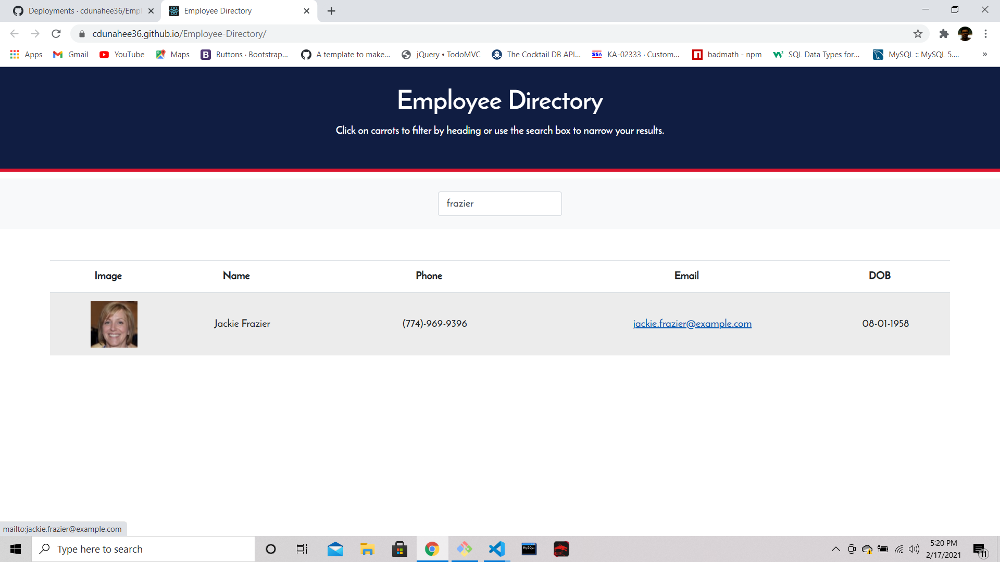
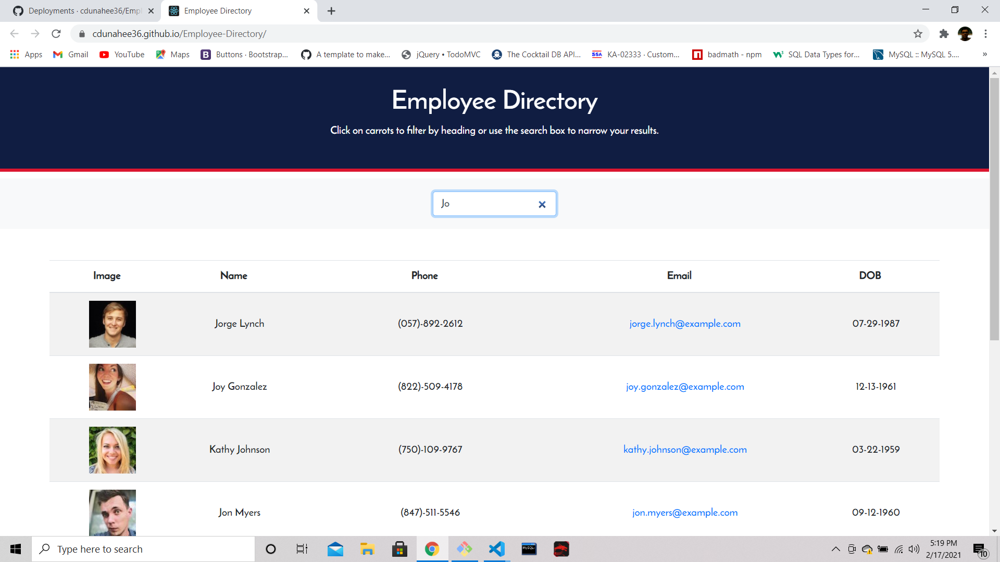

# Employee-Directory

## Link to live app
https://cdunahee36.github.io/Employee-Directory/

## Description 

* This application allows the user to search through a directory.
The user can search for an exact name or even just typing a certain
letter, it will return them a list of employees. Each employee will 
will return their picture, name, phone, email and DOB. The user can 
then contact an employeed via all ways listed above.

## Targeted Users

* This application would mainly target managers in a company, or even
the CEO of a company may find this to be very useful. A company can
keep better track of who works for them and contact an employee if needed.

## License

* MIT

## Screenshots

